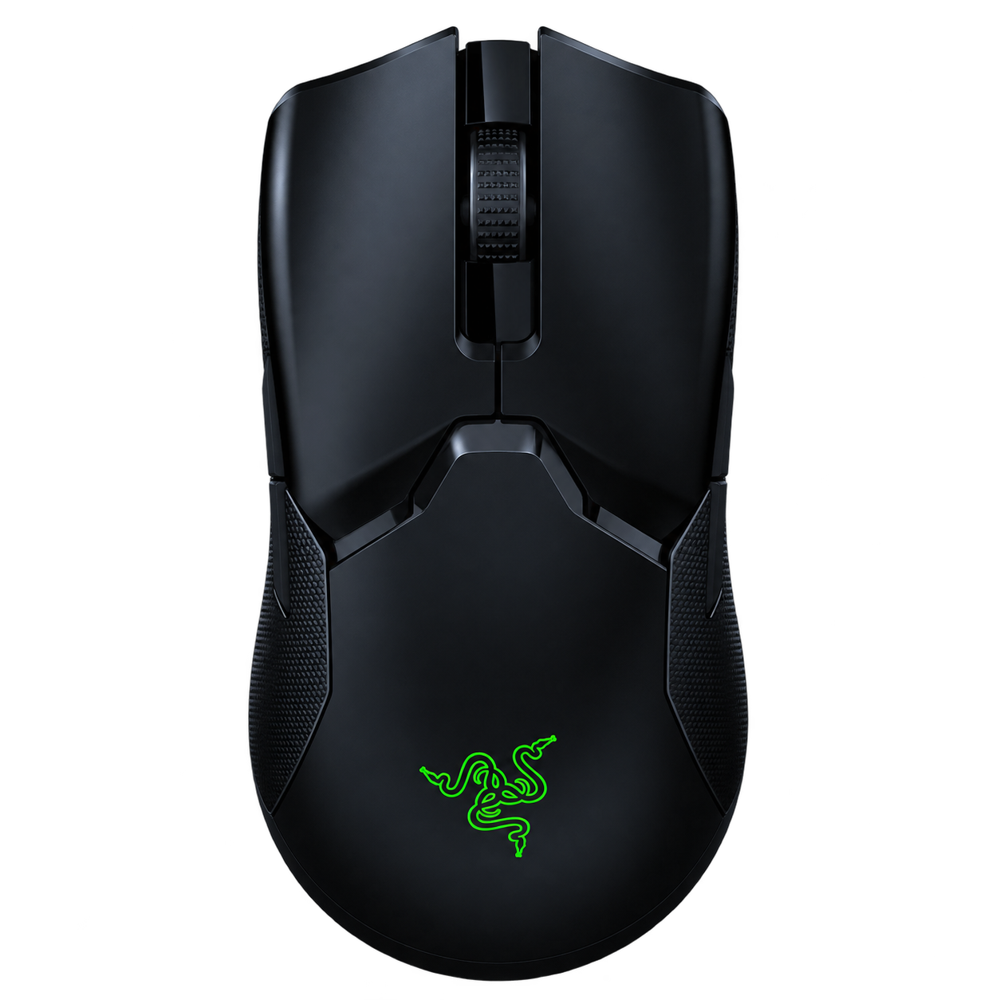

# Viper-Tray

<p align="center">
  
</p>

**Control your Razer Viper Ultimate from the Windows tray.** Viper Tray is a small native Rust app that puts battery status, DPI, polling, power settings, and lighting in the icon's right-click menu.

No Synapse, Electron, WebView, or bundled application runtime is required.

## Features

- **Battery at a glance** — battery icon, percentage tooltip, and charging indicator
- **Polling rate** — switch between 125, 500, and 1,000 Hz
- **Power settings** — set idle sleep from 1–15 minutes and the low-battery threshold from 5–25%
- **DPI control** — 100–20,000 DPI, separate X/Y axes, and up to five DPI stages
- **Logo lighting** — brightness, static colors, spectrum, reactive, and single/dual/random breathing
- **Saved presets** — five local slots for your mouse settings
- **Tray-only UI** — every control is in a native menu; no main window or settings panel
- **Quiet battery checks** — checks wait for an input break and back off after timeouts
- **Optional startup** — start with Windows through a per-user startup entry
- **Direct device access** — Windows HID commands using the OpenRazer protocol, without a custom driver

## Quick Start

1. Download the portable Windows ZIP from the [latest release](https://github.com/Dycool/Viper-Tray/releases/latest).
2. Extract `ViperTray-windows-x64.zip` and run `Viper-tray.exe`.
3. Find the battery icon beside the clock; Windows may put it in the tray overflow.
4. Right-click the icon to change mouse settings. Hover for battery percentage and connection status.
5. Choose **Settings → Refresh mouse settings** after changing settings elsewhere or pressing the mouse's DPI button.

The main menu groups controls into **Performance**, **Power**, **Lighting**, **Saved presets**, and **Settings**. Lighting effects, colors, and custom RGB values have their own submenus. Windows positions the main menu and its submenus.

The app has no main window and never sends notifications. The ZIP contains only `Viper-tray.exe`. Icons and notices are embedded in the executable; no external assets are needed.

> [!NOTE]
> Tested on a wireless Viper Ultimate: 512 menu-generated hardware commands, all five presets, startup toggling, and the native tray lifecycle. Software checks and hardware test coverage are documented below. Lighting is verified by device acknowledgement; visual appearance and long sleep/reconnect behavior require physical observation. See [VALIDATION.md](VALIDATION.md).

## Supported Mouse

| USB ID | Connection |
|---|---|
| `1532:007A` | Razer Viper Ultimate over USB cable |
| `1532:007B` | Razer Viper Ultimate wireless receiver |

The cable is preferred when both connections are present. If the receiver returns timeouts, connect the mouse by cable and refresh its settings. Unavailable values are shown as unavailable, and writes require a successful device response.

Mouse settings are read on connection and are never automatically overwritten at startup or reconnect. Individual changes verify only the changed setting and update the tray as soon as the mouse responds; a full reread is reserved for refresh, reconnect, and error recovery. Errors appear in the menu and diagnostic log without notifications. Discovery filters Viper interfaces before opening them, and feature requests have a three-second deadline with cancellation.

## Settings and Presets

Application preferences, saved presets, and a rotating diagnostic log are stored in:

```text
%APPDATA%\ViperTray
```

Presets are saved on the PC, not in Synapse's onboard profile slots. Refresh before saving if the displayed values are old. Lighting menus show this app's last acknowledged selection; they cannot read back an effect previously selected by another app.

**Start with Windows** adds the executable to the standard per-user startup registry entry. Disable that option, exit the app, and delete the portable folder to uninstall.

There is no telemetry, cloud account, network access, or background service.

## Building from Source

Requirements:

- Windows 10/11 x64
- stable Rust with Rust 2024 edition support
- current Windows SDK and MSVC build tools

Build:

```powershell
cargo build --release --locked
```

The executable is created at:

```text
target\release\viper-tray.exe
```

Create the portable ZIP, source archive, and checksums:

```powershell
./scripts/package.ps1
```

## GitHub Workflows

- **Windows build** — builds and packages pushes to `main`, pull requests, and manual runs; uploads the executable, portable ZIP, source ZIP, and checksums.
- **Release** — pushing a version tag such as `v1.0.0` checks the matching Cargo version, runs software checks, verifies the uploaded ZIP, and publishes only `ViperTray-windows-x64.zip`.
- **Tests and checks** — formatting, unit tests, and strict Clippy run automatically on pushes, pull requests, and manual builds. Device and tray integration tests are opt-in and never run in CI.

Workflows do not launch the tray app or perform hardware queries. Release downloads are published only after checks and upload verification succeed.

## How It Works

```text
Native tray menu
        ↓
Single USB worker
        ↓
OpenRazer feature reports over Windows HID
        ↓
Device acknowledgement + settings readback
```

Battery checks are deferred during active input and while the mouse appears asleep. Timeouts increase the interval up to 15 minutes. Choose **Manual only** to disable periodic battery queries.

## Known Limitations

- Windows 10/11 x64 and the Viper Ultimate only.
- Button remapping, macros, Hypershift, surface calibration, lift-off/landing distance, and onboard profile-slot management are not implemented.
- Chroma Studio synchronization, charging dock controls, pairing, and firmware updates are not implemented.
- Idle sleep can be extended to 15 minutes; there is no supported complete sleep-disable command.
- Wireless commands may time out on some receiver/firmware combinations. Competing mouse utilities can also interfere with access.
- A preset applies several settings in sequence. If a later write fails, earlier changes may already have reached the mouse.

See [device notes](docs/device-notes.md) for the full controls, protocol behavior, diagnostics, and feature boundaries.

## Acknowledgments

- [OpenRazer](https://github.com/openrazer/openrazer) for the device protocol and Viper Ultimate capability documentation.
- [RazerBatteryTaskbar](https://github.com/Tekk-Know/RazerBatteryTaskbar) for the battery tray app inspiration and the reused battery icon artwork.

Razer, Viper, and Synapse are trademarks of their respective owner. This project is independent and is not affiliated with or endorsed by Razer.

## License

Viper Tray is released under **GPL-2.0-or-later**. Dependencies retain their own licenses and copyright notices; see [THIRD_PARTY_NOTICES.md](THIRD_PARTY_NOTICES.md).
